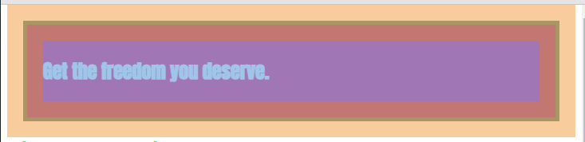
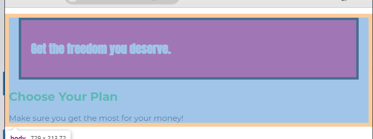
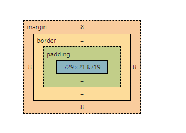
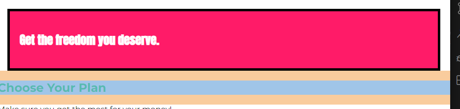
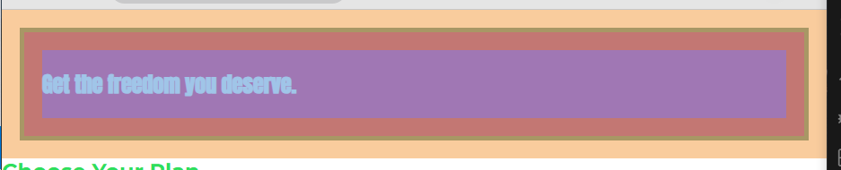
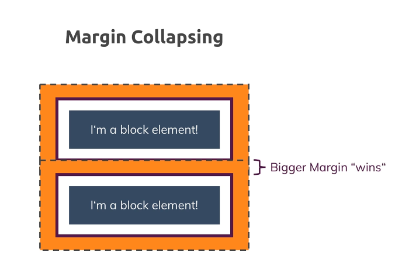

# css 요소 인식

크기나 높이를 키운다거나 필요한 요소를 더 추가하고 블록의 디자인 자체를 바꾸고 공백을 조정할 때에는 박스 모델을 사용

HTML의 모든 요소는 CSS 상에서 박스로 인식

모든 요소는 컨텐츠를 가지고 있음

계층 콘텐츠, 안쪽 여백, 테두리, 바깥쪽 여백까지 CSS 상에서 이 모든 요소는 박스로 인식

요소에는 블록 레벨과 인라인 레벨 두 유형이 존재.

모든 요소에 계층이 있다는 점만 기억

안쪽 여백(padding)을 추가하게 되면 그때부터 요소의 콘텐츠는 콘텐츠와 해당 콘텐츠에 대한 모든 여백을 통칭

안쪽 여백과 바깥쪽 여백이 서로 겹치면 안 되기 때문

따라서 안쪽 여백은 자식 요소의 바깥쪽 여백에 추가

박스 모델과 웹 페이지의 기본 스타일에 대해 반드시 알아야 하는 중요 사항이 몇 가지 있다.

## 마진과 마진상쇄

### 1. body의 바깥쪽에도 마진이 있다.

section을 보면 좌측과 우측에 주황색 바깥쪽 여백이 존재

body 클릭시에도 기본 여백이 존재

8px이며, 브라우저의 기본 설정값 요소가 바로 페이지의 끝에서부터 시작되도록 하려면 margin: 0 명령어를 통해 해당 바깥쪽 여백을 0으로 설정

이렇게 저장하고 페이지를 새로 고침 하면 더 이상 body에 바깥쪽 여백이 없음

따라서 section을 다시 살펴봐도 주황색 영역만 나옴

section의 바깥쪽 여백이 페이지의 끝에서부터 시작

페이지 끝과 section 사이에 공백이 사라짐

### 2. 마진 상쇄

다음 중요 사항은 두 번째 section인 plans section 내 h1 태그를 보면 알 수 있다.

이 section에 위아래로 바깥쪽 여백이 있는데 이는 바로 모든 h1 요소에 들어가는 기본 바깥쪽 여백 설정값으로, 주황색 영역에 해당

하나 눈여겨볼 점이 있는데 바로 위 section인 product-overview를 한번 보죠 위아래로 주황색 바깥쪽 여백

다시 h1 태그로 가 보면 product-overview 컨테이너와 여백이 겹친다는 것을 알 수 있음

바로 이 동작이 **여백 상쇄**

두 가지 요소가 있다고 가정하면 주황색 바깥쪽 여백을 갖는 박스 모델의 박스 요소

두 요소가 나란히 있을 때면 둘 사이 바깥쪽 여백이 상쇄, 더 큰 쪽이 덮어씌우는 것

버그가 아니라 의도적인 설계로 CSS에서 강제로 수행하는 작업

이렇게 하면 두 요소 간 거리가 너무 멀어지지 않게 유지

물론 알아서 하게 두라고 명령할 수도 있겠으나 CSS에서는 통하지 않으니 꼭 염두

따라서 이와 같은 경우에는 margin-top 혹은 margin-bottom을 이용해서 상쇄가 일어나는 일을 막는 것을 권장

작업하는 웹 페이지에서도 상쇄가 일어나지만 두 요소 간 거리가 크게 멀어지지 않기 때문에 상관은 없음

## height

페이지에 대해 높이를 조정하고자 하는 경우에는 페이지의 높이가 전체적으로 반영되도록 사슬 구조를 생성해야 함

이후 강의에서 dimension과 unit을 다룰 때 현대 단위를 이용해서 이 작업을 좀 더 쉽게 하는 방법을 배울 예정