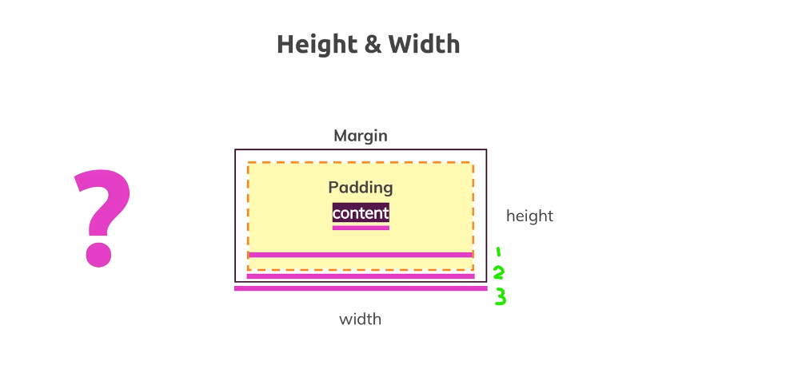
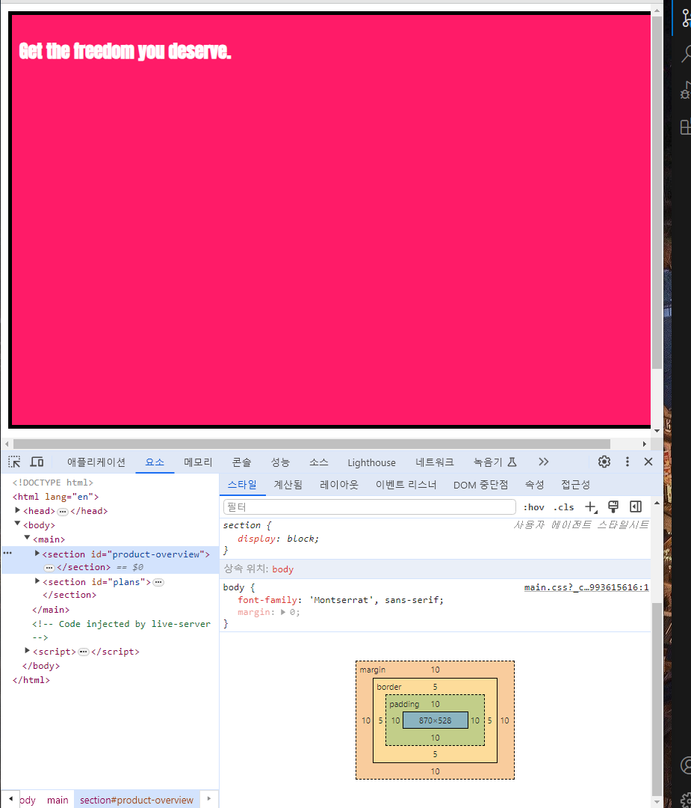
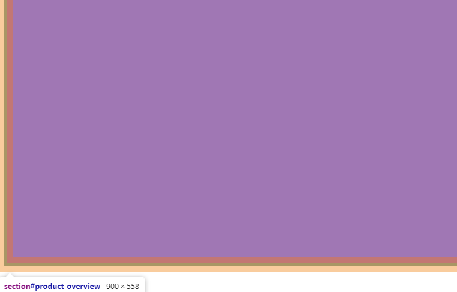
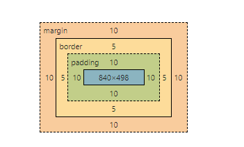
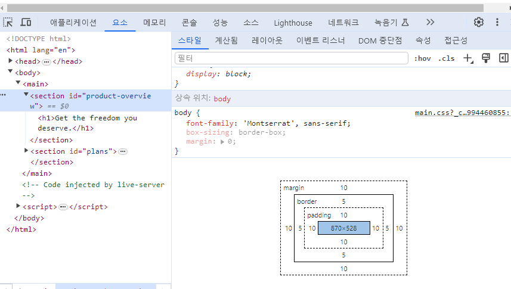
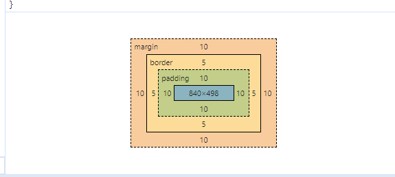

# css 요소 인식

크기나 높이를 키운다거나 필요한 요소를 더 추가하고 블록의 디자인 자체를 바꾸고 공백을 조정할 때에는 박스 모델을 사용

HTML의 모든 요소는 CSS 상에서 박스로 인식

모든 요소는 컨텐츠를 가지고 있음

계층 콘텐츠, 안쪽 여백, 테두리, 바깥쪽 여백까지 CSS 상에서 이 모든 요소는 박스로 인식

요소에는 블록 레벨과 인라인 레벨 두 유형이 존재.

모든 요소에 계층이 있다는 점만 기억

안쪽 여백(padding)을 추가하게 되면 그때부터 요소의 콘텐츠는 콘텐츠와 해당 콘텐츠에 대한 모든 여백을 통칭

안쪽 여백과 바깥쪽 여백이 서로 겹치면 안 되기 때문

따라서 안쪽 여백은 자식 요소의 바깥쪽 여백에 추가

박스 모델과 웹 페이지의 기본 스타일에 대해 반드시 알아야 하는 중요 사항이 몇 가지 있다.

## 마진과 마진상쇄

### 1. body의 바깥쪽에도 마진이 있다.

section을 보면 좌측과 우측에 주황색 바깥쪽 여백이 존재


body 클릭시에도 기본 여백이 존재


8px이며, 브라우저의 기본 설정값 요소가 바로 페이지의 끝에서부터 시작되도록 하려면 margin: 0 명령어를 통해 해당 바깥쪽 여백을 0으로 설정

이렇게 저장하고 페이지를 새로 고침 하면 더 이상 body에 바깥쪽 여백이 없음

따라서 section을 다시 살펴봐도 주황색 영역만 나옴

section의 바깥쪽 여백이 페이지의 끝에서부터 시작

페이지 끝과 section 사이에 공백이 사라짐

### 2. 마진 상쇄

다음 중요 사항은 두 번째 section인 plans section 내 h1 태그를 보면 알 수 있다.

이 section에 위아래로 바깥쪽 여백이 있는데 이는 바로 모든 h1 요소에 들어가는 기본 바깥쪽 여백 설정값으로, 주황색 영역에 해당


하나 눈여겨볼 점이 있는데 바로 위 section인 product-overview를 한번 보죠 위아래로 주황색 바깥쪽 여백


다시 h1 태그로 가 보면 product-overview 컨테이너와 여백이 겹친다는 것을 알 수 있음


바로 이 동작이 **여백 상쇄**

두 가지 요소가 있다고 가정하면 주황색 바깥쪽 여백을 갖는 박스 모델의 박스 요소

두 요소가 나란히 있을 때면 둘 사이 바깥쪽 여백이 상쇄, 더 큰 쪽이 덮어씌우는 것


버그가 아니라 의도적인 설계로 CSS에서 강제로 수행하는 작업

이렇게 하면 두 요소 간 거리가 너무 멀어지지 않게 유지

물론 알아서 하게 두라고 명령할 수도 있겠으나 CSS에서는 통하지 않으니 꼭 염두

따라서 이와 같은 경우에는 margin-top 혹은 margin-bottom을 이용해서 상쇄가 일어나는 일을 막는 것을 권장

작업하는 웹 페이지에서도 상쇄가 일어나지만 두 요소 간 거리가 크게 멀어지지 않기 때문에 상관은 없음


## height

페이지에 대해 높이를 조정하고자 하는 경우에는 페이지의 높이가 전체적으로 반영되도록 사슬 구조를 생성해야 함

이후 강의에서 dimension과 unit을 다룰 때 현대 단위를 이용해서 이 작업을 좀 더 쉽게 하는 방법을 배울 예정


## box sizing (박스 크기 조정)



width 조정했을때 변경된 것은 저기 중에 1번일까? 2번일까? 3번일까?



이제 padding을 section에 다시 추가 padding: 10px border: 5px

solid black으로 하고 margin: 10px까지 입력

이렇게 저장하고 페이지를 새로 고치면 변화가 하나 눈에 띈다. 박스가 오른쪽으로 좀 옮겨짐

width: 100%가 빨간색 박스 요소를 페이지의 오른쪽으로 튀어나가게 한 것

페이지 크기를 줄이거나 늘려도 100%로 설정되어 있어 크기가 변하지 않음

width, 즉 너비 설정에 문제가 생긴 것

이상한 점은 콘텐츠 높이가 528px로 나와 있는 것. 콘텐츠의 너비는 100%

단, 여기에 안쪽과 바깥쪽 여백과 그리고 테두리가 추가

이로 인해 실제 너비와 높이가 지정한 값보다 더 커지는 상황이 발생



실제 넓이는 900, 실제 높이는 558이 되어있음

따라서 콘텐츠의 높이와 너비를 정할 때에 안쪽 여백과 테두리가 함께 산출되지 않은 것

혹은 width와 height가 대상으로 하는 부분이 아님

하지만 이 모든 수치가 더해진 값이 브라우저에서 표시

결국 요소가 틀린 방식으로 위치하게 되는 원인이 된다.

이는 **content-box**라는 개념으로 모든 요소에는 기본적으로 너비와 높이를 산출하는 특정 방법이 내재되어 있음을 뜻한다.

이 동작은 해당 요소에 box-sizing이라는 프로퍼티를 추가함으로써 달리 설정할 수 있다.

기본 설정값은 content-box로, 이는 곧 여기서 설정하는 width와 height가 콘텐츠에만 국한되었으며 안쪽 여백과 테두리를 포함하는 전체 박스에 대한 값이 아니라는 뜻!

단, 이 프로퍼티를 border-box로 바꾸면 본 section의 너비와 높이 설정에 안쪽 여백과 테두리가 포함된다.

하지만 바깥쪽 여백(margin)은 포함되지 않는다.



아래 박스 모델로 한번 내려가 보면 이제 높이가 498px로 나온다.

여기에 아래와 위쪽에 대한 안쪽 여백 10px, 그리고 테두리 2px씩을 더하면 528px이 되며 이는 height에서 설정한 값

콘텐츠, 안쪽 여백, 테두리가 모두 포함된 값


이렇게 유용한 까닭에 일반적으로 모든 요소의 기본 설정값을 대체해서 쓰인다.

body section에 추가한 다음 저장하고 페이지를 새로 고침 한 뒤 다시 박스 모델로 내려가면 다시 content-box 설정으로 되돌아온 것을 알 수 있다.




이는 box-sizing 설정이 상속되었기 때문인데 해당 설정을 브라우저 기본 설정 스타일인 Styles에서는 찾아볼 수가 없다.

기본 설정은 블록 레벨 요소이기 때문에 자동으로 덮어 쓰임.

**즉, 상속이 아무 영향을 주지 못한 것은 section이 블록 레벨 요소여서 브라우저가 자체적으로 box-sizing을 설정했기 때문!**

따라서 이런 경우에는 전체(Universal) 선택자를 사용해야 하며 모든 요소의 특정 동작을 리셋하고자 할 때 사용하는 방법이며 지금은 box-sizing: border-box를 사용하기 위함이다.

```css
*{
    /* 상속이 이루어지지 못하도록 진행 */
    box-sizing: border-box;
}
```

이렇게 하면 body에서 설정된 것과 동일하지 않은 메커니즘이 쓰이며 각 요소에 개별적으로 적용되어서 상속과 더불어 브라우저 기본 설정을 덮어쓴 다음, box-sizing: border-box를 각각 설정한다.




이렇게 추가하고 페이지를 새로 고침 한 다음 박스 모델을 보면 이전에는 콘텐츠의 너비와 높이가 안쪽 여백, 그리고 테두리를 포함하지 않았지만, 이제는 높이와 너비를 설정하면 안쪽 여백과 테두리의 크기까지 포함해서 계산한다.